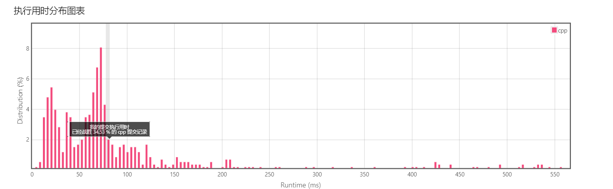

# Task05

### 1.无重复长度的最长字串

```c
int lengthOfLongestSubstring(char *s)
{
    int i, j, k = 0, max = 0, cnt = 0;
    for (i = 0; s[i] != '\0'; i++)
    {
        for (j = k; j < i; j++)
        {
            if (s[i] == s[j])
            {
                if (cnt > max)
                    max = cnt;
                cnt = i - j;
                k = j + 1;
                break;
            }
        }
        if (j == i)
            cnt++;
        if (cnt > max)
            max = cnt;
    }
    return max;
}
```

### 2.串联所有单词的字串
```c
#include<bits/stdc++.h>
using namespace std;

int* findSubstring(char * s, char ** words, int wordsSize, int* returnSize){
    *returnSize = 0;
    if (s == NULL || strlen(s) == 0 || words == NULL || wordsSize == 0) {
        return NULL;
    }
    int sLen = strlen(s);
    int wLen = strlen(words[0]);
    int* ret = (int *)malloc(sizeof(int) * sLen);    
    memset(ret, 0, sizeof(int) * sLen);
    int* flagArr = (int*)calloc(sizeof(int), wordsSize);
    char* compareStr = (char*)calloc(sizeof(char), wLen + 1);
    int needFinds = sLen - wLen * wordsSize;
    int retFindflag = false;
    for (int i = 0; i <= needFinds; i++) {
        retFindflag = false;
        for (int j = i; j <= sLen - wLen; j += wLen) {
            strncpy(compareStr, s + j, wLen);    
            retFindflag = Find(compareStr, flagArr, words, wordsSize);
            if (retFindflag == false) {
                break;
            }
        }
        if (LastFindFlag(flagArr, wordsSize) == true) {
            ret[*returnSize] = i;
            *returnSize += 1;
        }
        memset(flagArr, 0, sizeof(int) * wordsSize);
    }
    free(flagArr);
    free(compareStr);
    return ret;
}

int Find(char* compareStr, int* flagArr, char **words, int wordsSize)
{
    for (int i = 0; i < wordsSize; i++) {
        if (flagArr[i] == true) {
            continue;
        }
        if (strcmp(compareStr, words[i]) == 0) {
            flagArr[i] = true;
            return true;
        }
    }
    return false;
}

int LastFindFlag(int* flagArr, int wordsSize) {
     for (int i = 0; i < wordsSize; i++) {
         if (flagArr[i] != true) {
             return false;
         }
     }
     return true;
}
```

### 3.替换子串得到平衡字符串

```c
int cnt[4];
    map<char, int> mp;
    int len = 0;
    int pre[1000005][4];
    vector<int> v;
    int n;
    bool ok(int x) {
        
        for(int i = 0; i+x <= n; i++) {
            int sum = 0;
            bool flag = true;
            for(int j = 0; j < v.size(); ++j) {
                if(!(pre[i+x][v[j]]-pre[i][v[j]] >= cnt[v[j]]))
                    flag = false;
            }
            if(flag) {
                return true;
            }
        }
        return false;
    }
    int balancedString(string s) {
        n = s.length();
        mp['Q'] = 0; mp['W'] = 1; mp['E'] = 2; mp['R'] = 3;
        for(int i = 0; i < s.length(); ++i) {
            cnt[mp[s[i]]]++;

            for(int j = 0; j < 4; ++j)
                pre[i+1][j] = pre[i][j];
            pre[i+1][mp[s[i]]]++;

        }
        int biao = s.length()/4;
        // cout << biao << endl;
        for(int i = 0; i < 4; ++i) {
            // cout << i << " " << cnt[i] << endl;
            cnt[i] -= biao;
            if(cnt[i] > 0) {
                len += cnt[i];
                v.push_back(i);
            }
        }
        int l = len, r = s.length(), ans = r;
        while(l <= r) {
            int mid = (l+r) >> 1;
            if(ok(mid)) {
                // cout << ans << endl;
                ans = mid;
                r = mid-1;
            }
            else 
                l = mid+1;
        }
        return ans;

    }

```
